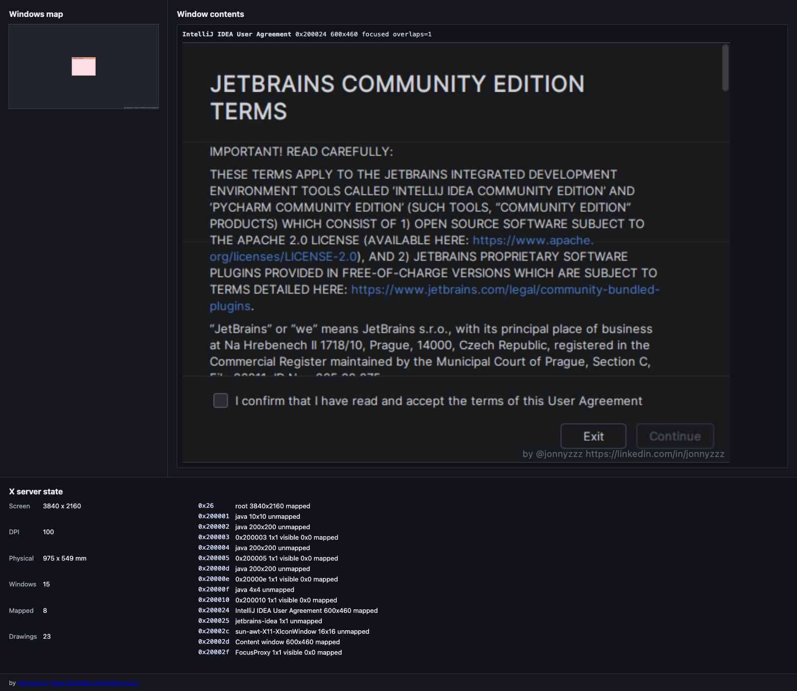

# X

X is a Kotlin/JVM implementation of a headless X11 server.

The project has two equal goals:

1. Implement a valid X11 server over the wire, starting with the smallest core protocol subset that real clients can exercise.
2. Expose the display as useful "eyes" for AI agents: pixels, frame changes, input/events, and a structured hierarchy of screens, windows, drawables, and resources.

This repository intentionally targets X11 first. Wayland, Projector-style remote Swing transports, and desktop/window-manager policy are out of scope for the initial milestones.

## Current Status

The current server accepts X11 TCP connections, returns a deterministic one-screen setup reply, and implements a small core request subset for atoms/properties, root/window queries, simple window lifecycle, colors, cursors, fonts, and no-op drawing requests.

It can run the first Docker smoke matrix against real X clients:

- `xdpyinfo`
- `xwininfo -root`
- `xprop -root`
- `xlogo`
- `xclock`
- `xeyes`
- `xcalc`
- `twm` with overlapping app windows
- IntelliJ IDEA Community from GitHub releases in an opt-in heavyweight smoke

The graphical apps are still compatibility smoke tests rather than full visual conformance tests. Rendering now includes the maintained window model and `PutImage` pixel data in SVG previews, but more X drawing semantics are still pending, especially pixmap-backed composition and broader GC operations.

The same TCP port also serves HTTP for agent observation:

- `/` returns an HTML page with an embedded SVG screen view.
- `/screen.svg` returns only the SVG screen view.
- `/text` returns an HTML text report.
- `/text.txt` returns the plain text report.
- `/state.json` returns a compact JSON snapshot.
- `/input/click` accepts pointer click requests and injects X11 `ButtonPress`/`ButtonRelease` events.

The SVG and text renderers both use the maintained X server state model: windows, labels, mapping state, focus, stacking order, and overlap rectangles.
The HTML/SVG view is also an input surface: clicking the window map or a large window preview posts to the same `/input/click` API that agents can call directly.



The test suite starts with:

- raw socket protocol tests for the setup handshake,
- a Testcontainers/Xvfb smoke test that proves the Docker compatibility harness can run real X clients,
- a Testcontainers smoke test that runs real X11 tools and simple apps against the Kotlin server.

## Development

```bash
./gradlew test
```

Docker integration tests require Docker to be available to the current user. Build the local test/demo images before running Docker-backed tests:

```bash
./gradlew dockerBuildX11Images
./gradlew test
```

There are two local images:

- `jonnyzzz-x/x11-client:latest` is the demo/client image. It is Ubuntu-based and includes X11 tools, `twm`, and the native libraries required by JetBrains Runtime/IntelliJ. It does not include Xvfb.
- `jonnyzzz-x/x11-reference:latest` extends the client image with Xvfb for reference-only comparison tests.

Build only the reusable X11 client image before running heavyweight GUI demos:

```bash
./gradlew dockerBuildX11Client
```

The IntelliJ release archive is intentionally not baked into the image; `run-intellij`
downloads it on first use inside the container.

The IntelliJ Community smoke is intentionally opt-in because it downloads a large GitHub release artifact:

```bash
./gradlew dockerBuildX11Client
./gradlew test --tests org.jonnyzzz.xserver.IntellijCommunitySmokeTest -Dx.intellijSmoke=true
```

Run the prototype server:

```bash
./gradlew run --args='--host 0.0.0.0 --port 6000'
```

Then point simple X clients at it with `DISPLAY=host:0`, or open `http://host:6000/` to inspect the maintained server model as SVG/text.

Run the 4K/100 DPI IntelliJ Docker demo:

```bash
./gradlew installDist dockerBuildX11Client
docker rm -f x-demo-server x-demo-idea
docker run -d --name x-demo-server \
  -p 6000:6000 -p 16000:6000 \
  -v "$PWD/build/install/x:/app:ro" \
  mcp-steroid-base:latest \
  /app/bin/x --host 0.0.0.0 --port 6000 --width 3840 --height 2160 --dpi 100
docker run -d --name x-demo-idea \
  jonnyzzz-x/x11-client:latest \
  sh -lc 'touch /tmp/idea-run.log; DISPLAY=host.docker.internal:0 run-intellij >>/tmp/idea-run.log 2>&1 & tail -f /tmp/idea-run.log'
```

Open `http://127.0.0.1:16000/` for the HTML page with the SVG window map, large per-window previews, and state summary. Use `http://127.0.0.1:16000/text.txt` for a plain-text snapshot.

Send input through the HTTP API:

```bash
curl -fsS -X POST http://127.0.0.1:16000/input/click \
  -H 'Content-Type: application/x-www-form-urlencoded' \
  --data 'x=1920&y=1080&button=left'
```

`button` accepts `left`, `middle`, `right`, `wheel-up`, `wheel-down`, or the raw X11 button number `1..5`.

Current IntelliJ demo limitation: dialogs rendered through Java2D/AWT are visible and clickable, but JCEF/Chromium surfaces report `GLX is not present` because the server does not implement the GLX extension yet. The HTTP state report logs every input operation so click-through attempts can be replayed and refined.

Run simpler X11 demo clients against an already running server:

```bash
docker run --rm jonnyzzz-x/x11-client:latest run-x11-apps
```

## Roadmap

The first compatibility milestone is deliberately smaller than full Xvfb parity:

1. X11 setup handshake, endian handling, sequence numbers, request length validation, replies, errors, and connection close.
2. One-screen server model with root window, fixed true-color visual/depth, atoms/properties, resource IDs, and basic window tree operations.
3. Events and hierarchy snapshots before broad rendering, because clients often fail early on event semantics.
4. Framebuffer, pixmaps, graphics contexts, `PutImage`, `GetImage`, `ClearArea`, and `CopyArea`.
5. Dockerized differential tests against Xvfb for `xdpyinfo`, `xprop`, `xwininfo`, `xlogo`, `xclock`, and then JBR/IntelliJ smoke tests.

See `workflow/roadmap.md` and `workflow/test-matrix.md`.

## License

The project source is MIT licensed. Vendored specifications and third-party reference material keep their original notices.
